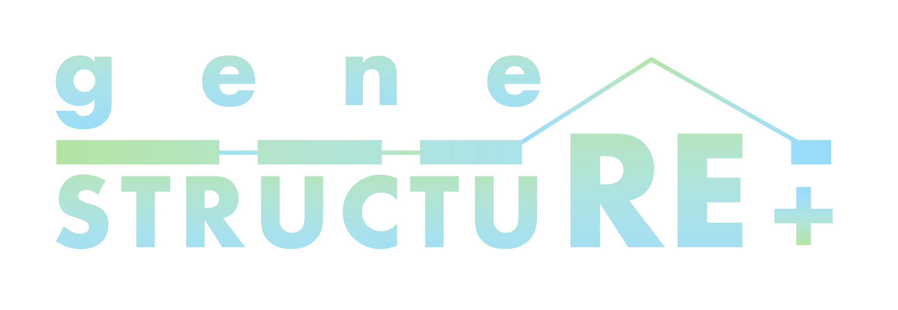

[](https://github.com/bvv-1/gene-structure/actions/workflows/generate-api-types.yml)

# A high-quality visualization tool for gene structures
## Citation
Hashimoto, yamada and Izawa. in prepareing.


## Features

- Load gene structures from GFF3 files
- Visualization of exons, CDS, UTRs, introns, and domains
- Conversion of protein domain coordinates (amino acid level) to genomic coordinates
- Support for deletion regions
- Output in SVG format
- Three interfaces: Web UI, REST API, and CLI

## Start the Web Application
You can immediately try the web application here. No installation is required. Simply open the link in your browser to start visualizing gene structures.
https://gene-structure.vercel.app/

## Development Environment

### Requirements

- Node.js 22.14.0 (version managed with mise)
- Python 3.12 or higher

### Setup

First, create and activate a virtual environment:

```bash
python3 -m venv venv
source venv/bin/activate
```

Next, install dependencies:

```bash
npm install
pip install -r requirements.txt
```

Then, start the development server:

```bash
npm run dev
```

Open http://localhost:3000 in your browser to view the application.

### Running FastAPI Server Only

```bash
source venv/bin/activate
python3 -m uvicorn api.index:app --reload --host 127.0.0.1 --port 8000
```

# API documentation
http://127.0.0.1:8000/api/py/docs

## Usage

### Web UI

# Access via browser
https://gene-structure.vercel.app/

### REST API

```bash
curl -X POST "http://127.0.0.1:8000/api/py/generate-gene-structure-svg"   -H "Content-Type: application/json"   -d '{
    "gene_structure": {
      "transcript_id": "Os06t0160700-01",
      "seq_id": "chr06",
      "strand": "+",
      "exons": [{"start": 100, "end": 200}],
      "cds": [{"start": 120, "end": 180}],
      "five_prime_utrs": [],
      "three_prime_utrs": []
    }
  }'   -o output.svg
```

#### API Parameters

- gene_structure (required): Gene structure object
  # transcript-level annotation
  - transcript_id
  - seq_id
  - strand (+ or -)
  - exons
  - cds
  - five_prime_utrs
  - three_prime_utrs

# optional annotations
- domains (optional)
- deletion_regions (optional)

### CLI Tool

```bash
source venv/bin/activate
python3 api/original.py
```

# Parameters are defined inside api/original.py
```python
gff_file = './geneSTRUCTURE_v2/gff3/IRGSP-1.0_representative/transcripts.gff'
transcript_id = 'Os06t0160700-01'
deletion_regions_relative = []
domains = [
    {'start': 200, 'end': 500, 'name': 'Kinase', 'color': 'red'},
    {'start': 600, 'end': 800, 'name': 'ATPase', 'color': 'blue'}
]
```

# Output file
{transcript_id}_with_relative_deletions.svg

## Project Structure

```
.
├── app/                      # Frontend (Next.js)
│   ├── components/          # Shared components
│   │   ├── Layout.tsx       # Layout component
│   │   └── SvgViewer.tsx    # SVG viewer (react-svg-pan-zoom)
│   ├── utils/               # Utilities
│   │   ├── gff.ts           # GFF3 parser
│   │   └── gff.test.ts      # Test for GFF parser
│   ├── api/                 # Next.js API routes
│   │   ├── list-gffs/       # Fetch GFF list
│   │   └── upload-gff/      # Upload GFF
│   ├── docs/                # Documentation
│   ├── faq/                 # FAQ
│   ├── page.tsx             # Main page
│   └── layout.tsx           # Root layout
├── api/                      # Backend (FastAPI)
│   ├── index.py             # FastAPI endpoint
│   ├── models.py            # Data models
│   ├── drawer.py            # SVG rendering logic
│   └── parser.py            # Parser
├── geneSTRUCTURE_v2/        # GFF3 data
│   └── gff3/
│       └── IRGSP-1.0_representative/
│           └── transcripts.gff
├── requirements.txt         # Python dependencies
├── package.json             # Node.js dependencies
├── tsconfig.json            # TypeScript config
├── biome.json               # Formatter / linter
├── next.config.js           # Next.js config
└── README.md                # Project description
```

## Tech Stack

### Frontend
- Next.js 16
- React 19
- TypeScript
- Mantine v8 (UI components)
- react-svg-pan-zoom (SVG viewer)
- @gmod/gff (GFF3 parser)
- @gmod/gtf (GTF parser)

### Backend
- FastAPI
- Python 3.12
- svgwrite (SVG generation)
- reportlab (PDF generation)
- Pydantic (validation)

### Development Tools
- Biome (formatter/linter)
- Vitest (testing)
- mise (Node version manager)
- orval (OpenAPI types)

## Testing

```bash
# frontend test
npm run test

# type check
npm run ts

# format
npm run fmt
```

## Contributing

1. Fork this repository
2. Create a feature branch (`git checkout -b feature/amazing-feature`)
3. Commit changes (`git commit -m 'feat: add amazing feature'`)
4. Push branch (`git push origin feature/amazing-feature`)
5. Create a Pull Request
